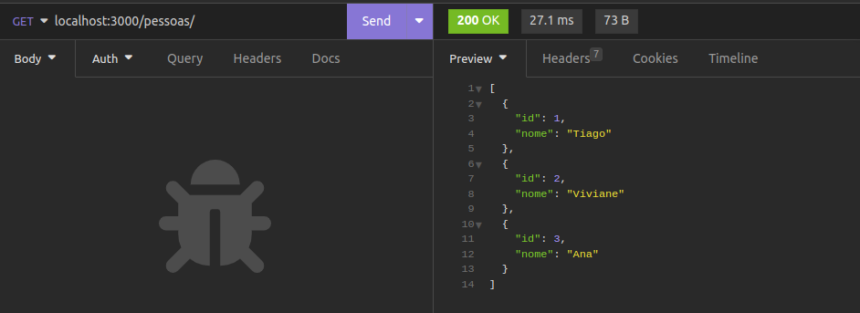
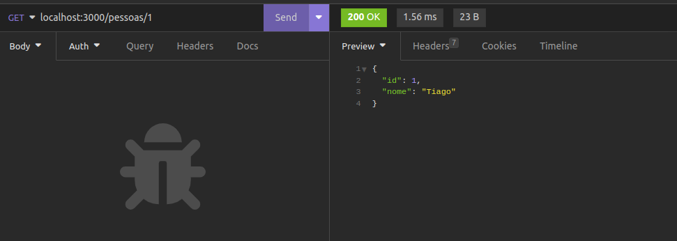
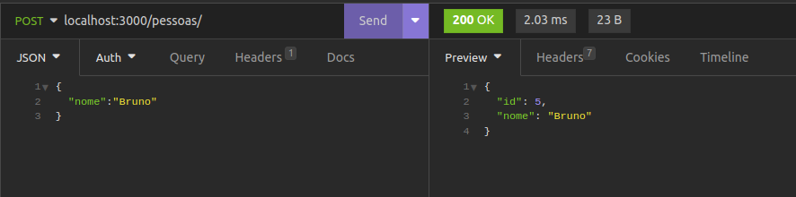
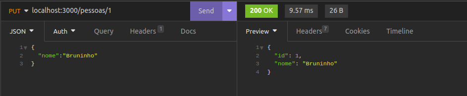
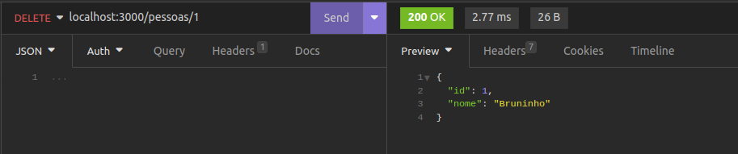

# Iniciando o projeto do NodeJS

- Crie uma pasta para você trabalhar.
- Abra essa pasta no vs code.
- Abra terminal no menu Terminal -> Novo Terminal
- Digite o comando para iniciar o projeto e vá apertando ENTER para confirmar as configuraões do projeto:

		npm init
- Para instalar a extensão que reinicia a aplicação automaticamente:
        
    	npm install --save-dev nodemon
- Para instalar a dependência para funcionar o servidor e o leitor de json:
		
		npm install express body-parser
- Abra o arquivo `package.json` e adicione a seguinte linha em scripts (não se esqueça da vírgual no final da linha anterior):

		"start": "nodemon index.js"

- Para executar a aplicação:
		
		npm start
- Implemente as funções do arquivo `index.js`.
- Abra o `insomnia`
- Para testar o método `get`:

- Para testar o método `get` com filtro:

- Para testar o método `post`:

- Para testar o método `put`:

- Para testar o método `delete`:
